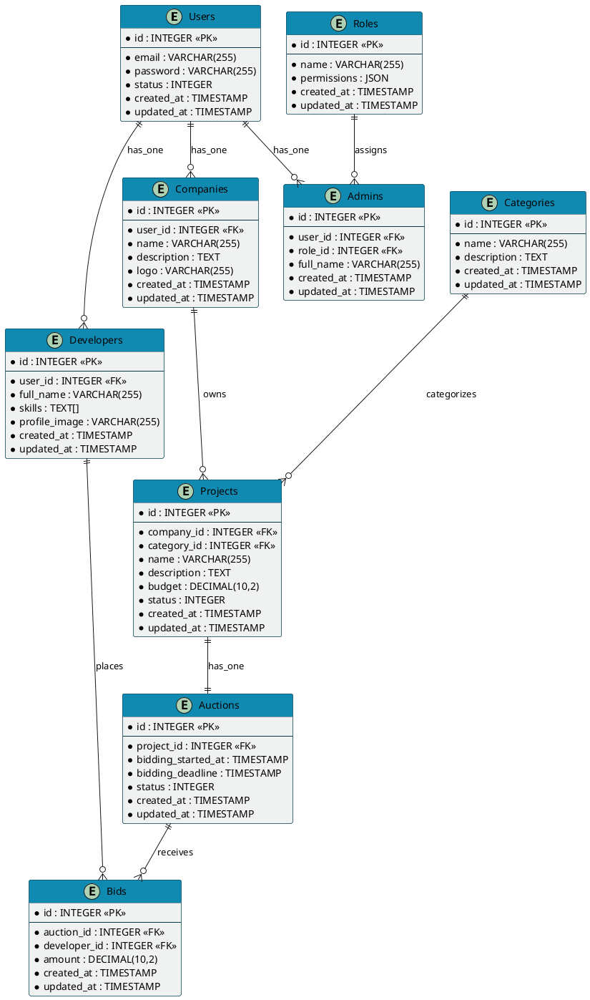
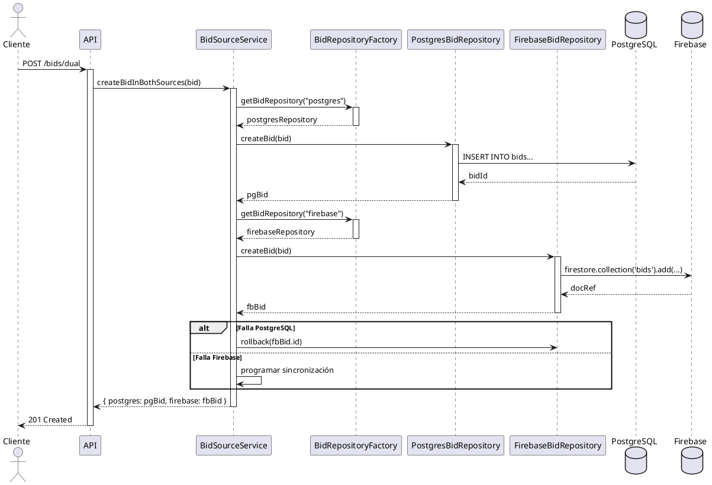
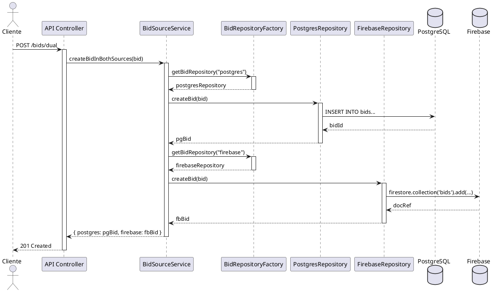
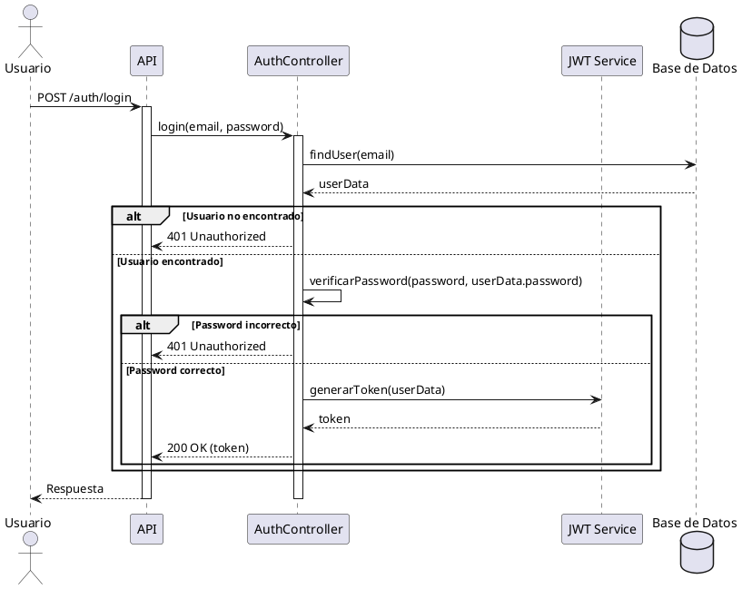
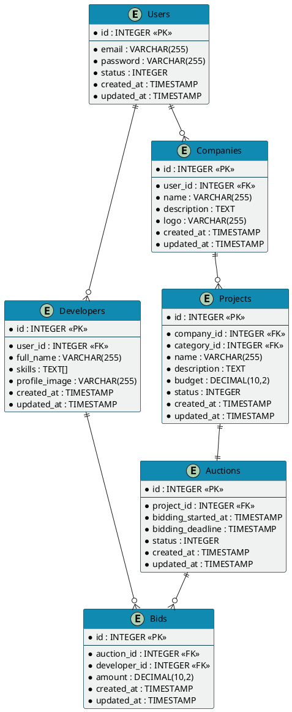

# Manual Técnico - Sistema de Subastas

<div style="text-align: center; margin-bottom: 30px;">
    
    <h2>Versión 2.0</h2>
    <p><strong>Fecha de última actualización:</strong> Julio 2025</p>
</div>

## Índice
1. [Introducción](#introducción)
   - [Objetivo del Sistema](#objetivo-del-sistema)
   - [Alcance del Documento](#alcance-del-documento)
   - [Audiencia Objetivo](#audiencia-objetivo)

2. [Arquitectura del Sistema](#arquitectura-del-sistema)
   - [Visión General](#visión-general)
   - [Componentes Principales](#componentes-principales)
   - [Patrones de Diseño](#patrones-de-diseño)
   - [Sistema Dual de Almacenamiento](#sistema-dual-de-almacenamiento)

3. [Requisitos del Sistema](#requisitos-del-sistema)
   - [Requisitos de Software](#requisitos-de-software)
   - [Requisitos de Hardware](#requisitos-de-hardware)
   - [Dependencias Externas](#dependencias-externas)

4. [Estructura del Proyecto](#estructura-del-proyecto)
   - [Organización de Directorios](#organización-de-directorios)
   - [Componentes Clave](#componentes-clave)

5. [Configuración del Entorno](#configuración-del-entorno)
   - [Variables de Entorno](#variables-de-entorno)
   - [Instalación y Configuración](#instalación-y-configuración)
   - [Configuración de Firebase](#configuración-de-firebase)

6. [Arquitectura de Datos](#arquitectura-de-datos)
   - [Modelo Relacional (PostgreSQL)](#modelo-relacional-postgresql)
   - [Modelo NoSQL (Firebase)](#modelo-nosql-firebase)
   - [Sincronización entre Fuentes de Datos](#sincronización-entre-fuentes-de-datos)

7. [APIs y Endpoints](#apis-y-endpoints)
   - [Convenciones REST](#convenciones-rest)
   - [Endpoints por Dominio](#endpoints-por-dominio)
   - [Referencia de API](#referencia-de-api)

8. [Seguridad](#seguridad)
   - [Autenticación y Autorización](#autenticación-y-autorización)
   - [Protección de Datos](#protección-de-datos)
   - [Mejores Prácticas Implementadas](#mejores-prácticas-implementadas)

9. [Patrones y Diseño del Código](#patrones-y-diseño-del-código)
   - [Repository Pattern](#repository-pattern)
   - [Factory Pattern](#factory-pattern)
   - [Service Layer](#service-layer)
   - [Middlewares](#middlewares)

10. [Manejo de Errores](#manejo-de-errores)
    - [Estrategia de Manejo de Errores](#estrategia-de-manejo-de-errores)
    - [Códigos de Error](#códigos-de-error)
    - [Logging](#logging)

11. [Despliegue y DevOps](#despliegue-y-devops)
    - [Entornos](#entornos)
    - [CI/CD](#cicd)
    - [Monitoreo](#monitoreo)

12. [Pruebas](#pruebas)
    - [Estrategia de Pruebas](#estrategia-de-pruebas)
    - [Pruebas Unitarias](#pruebas-unitarias)
    - [Pruebas de Integración](#pruebas-de-integración)

13. [Anexos](#anexos)
    - [Glosario](#glosario)
    - [Referencias](#referencias)
    - [Historial de Versiones](#historial-de-versiones)

14. [Diagramas](#diagramas)
    - [Diagramas de Arquitectura](#diagramas-de-arquitectura)
    - [Diagramas de Secuencia](#diagramas-de-secuencia)
    - [Diagramas ER](#diagramas-er)

## Introducción

### Objetivo del Sistema

El Sistema de Subastas es una plataforma backend especializada para la gestión completa de subastas de proyectos digitales, conectando empresas que necesitan soluciones tecnológicas con desarrolladores calificados. La plataforma permite:

- **Para Empresas**: Publicar proyectos, establecer presupuestos, revisar ofertas y seleccionar desarrolladores.
- **Para Desarrolladores**: Descubrir proyectos, realizar ofertas competitivas y gestionar sus aplicaciones.
- **Para Administradores**: Supervisar todas las operaciones, mediar disputas y mantener la integridad del sistema.

### Alcance del Documento

Este manual técnico abarca la arquitectura, diseño, implementación y operación del sistema backend de subastas, incluyendo:

- Arquitectura completa del sistema y patrones de diseño
- Sistema dual de almacenamiento (PostgreSQL + Firebase)
- APIs RESTful y servicios
- Mecanismos de seguridad y autenticación
- Configuración y despliegue en diferentes entornos

### Audiencia Objetivo

Este documento está dirigido principalmente a:

- **Desarrolladores**: Para comprender la estructura del código, patrones implementados y extensión del sistema
- **DevOps**: Para la configuración, despliegue y mantenimiento de los entornos
- **Arquitectos de Software**: Para comprender las decisiones de diseño y potenciales evoluciones
- **Administradores de Sistema**: Para la configuración y mantenimiento de la infraestructura

## Arquitectura del Sistema

### Visión General

El sistema de subastas implementa una arquitectura de microservicios con una capa API REST centralizada, siguiendo principios de diseño SOLID y Clean Architecture. La característica distintiva es su **sistema dual de almacenamiento** que permite operaciones de alta disponibilidad y consistencia entre PostgreSQL y Firebase.


### Componentes Principales

| Componente | Tecnología | Propósito |
|------------|------------|-----------|
| **Servidor API** | Node.js + Express | Procesa las peticiones HTTP y orquesta la lógica de negocio |
| **Base de Datos Relacional** | PostgreSQL | Almacenamiento principal, garantiza integridad referencial |
| **Base de Datos NoSQL** | Firebase Firestore | Almacenamiento secundario, optimizado para tiempo real |
| **Capa de Autenticación** | JWT + Passport | Gestión de identidad y control de acceso |
| **Capa de Persistencia** | Sequelize + Repository Pattern | Abstracción del acceso a datos |
| **Documentación API** | Swagger/OpenAPI | Documentación interactiva de endpoints |
| **Almacenamiento de Archivos** | AWS S3 | Gestión de archivos y documentos |
| **Notificaciones** | Node-cron + Nodemailer | Sistema de alertas y comunicaciones |

### Patrones de Diseño

El sistema implementa diversos patrones para garantizar mantenibilidad, escalabilidad y testabilidad:

- **Repository Pattern**: Abstrae el acceso a datos permitiendo múltiples implementaciones (PostgreSQL, Firebase)
- **Factory Pattern**: Crea instancias apropiadas de repositorios según la configuración
- **Strategy Pattern**: Permite intercambiar implementaciones de servicios en tiempo de ejecución
- **Middleware Pattern**: Procesa peticiones HTTP secuencialmente para autenticación, validación, etc.
- **Service Layer**: Encapsula la lógica de negocio independientemente de los controladores

### Sistema Dual de Almacenamiento

Una característica clave del sistema es su capacidad de trabajar con dos fuentes de datos simultáneamente:


- **PostgreSQL**: Base de datos principal que garantiza ACID y mantiene relaciones complejas
- **Firebase Firestore**: Base de datos secundaria que proporciona acceso en tiempo real y alta disponibilidad
- **Sincronización bidireccional**: Mecanismos para mantener la consistencia entre ambos sistemas

## Requisitos del Sistema

### Requisitos de Software

| Componente | Versión Mínima | Versión Recomendada | Notas |
|------------|----------------|---------------------|-------|
| **Node.js** | 14.x | 18.x o superior | Se recomienda LTS para entornos de producción |
| **PostgreSQL** | 12.x | 15.x | Se requieren extensiones uuid-ossp y pg_trgm |
| **npm/yarn** | npm 6.x / yarn 1.x | npm 9.x / yarn 2.x | Preferible yarn para entornos CI/CD |
| **Firebase CLI** | 11.x | 12.x | Para gestión de reglas y configuraciones |
| **Docker** | 20.x | 23.x | Opcional, para desarrollo y CI/CD |

### Requisitos de Hardware

#### Desarrollo
- CPU: 2+ cores
- RAM: 4GB mínimo
- Almacenamiento: 20GB SSD
- Red: 10Mbps+

#### Producción (Recomendado)
- CPU: 4+ cores
- RAM: 8GB mínimo
- Almacenamiento: 50GB SSD
- Red: 100Mbps+ con baja latencia

### Dependencias Externas

| Servicio | Propósito | Alternativas |
|----------|-----------|--------------|
| **Firebase** | Almacenamiento NoSQL en tiempo real | MongoDB Realm, AWS DynamoDB |
| **AWS S3** | Almacenamiento de archivos | Google Cloud Storage, Azure Blob Storage |
| **Sendgrid/Mailgun** | Envío de correos transaccionales | AWS SES, Postmark |
| **Google OAuth** | Autenticación federada | Auth0, Okta, Firebase Auth |

## Estructura del Proyecto

### Organización de Directorios

```
backend-auction/
├── src/                       # Código fuente principal
│   ├── app.js                 # Punto de entrada de la aplicación
│   ├── config/                # Configuraciones centralizadas
│   │   ├── connection.js      # Conexión a PostgreSQL
│   │   ├── firebase.js        # Configuración de Firebase
│   │   ├── swagger.js         # Configuración de Swagger
│   │   └── domainConstants.js # Constantes del dominio
│   ├── controllers/           # Controladores REST
│   │   ├── AuctionsController.js
│   │   ├── BidSourceController.js  # Control de fuentes de pujas
│   │   └── ...
│   ├── helpers/               # Funciones auxiliares
│   ├── middlewares/           # Middlewares Express
│   │   ├── authenticateToken.js
│   │   ├── validate.js
│   │   └── ...
│   ├── models/                # Modelos de Sequelize
│   │   ├── AuctionsModel.js
│   │   ├── BidsModel.js
│   │   └── ...
│   ├── repositories/          # Implementación del Repository Pattern
│   │   ├── IBidRepository.js           # Interfaz abstracta
│   │   ├── PostgresBidRepository.js    # Implementación PostgreSQL
│   │   ├── FirebaseBidRepository.js    # Implementación Firebase
│   │   └── BidRepositoryFactory.js     # Fábrica de repositorios
│   ├── routes/                # Definición de rutas API
│   ├── services/              # Lógica de negocio
│   │   ├── bidSourceService.js         # Servicio dual de pujas
│   │   └── ...
│   ├── utils/                 # Utilidades generales
│   └── validations/           # Esquemas de validación (Joi)
├── scripts/                   # Scripts de utilidad
│   ├── firebase-simple.js     # Consultas a Firebase
│   └── ...
├── docs/                      # Documentación técnica
│   ├── manual-tecnico.md
│   └── diagrams/              # Diagramas PlantUML
├── tests/                     # Pruebas automatizadas
│   ├── unit/
│   └── integration/
└── package.json
```

### Componentes Clave

| Directorio | Propósito | Responsabilidad |
|------------|-----------|-----------------|
| **config/** | Centraliza configuraciones | Mantener parámetros de conexión y configuraciones del sistema |
| **controllers/** | Capa de presentación API | Manejar peticiones HTTP, validar entrada y coordinar servicios |
| **repositories/** | Implementación del patrón repositorio | Abstraer acceso a datos con múltiples implementaciones |
| **models/** | Definición de modelos | Representar entidades de negocio y mapearlas a la base de datos |
| **services/** | Lógica de negocio | Encapsular reglas de negocio independientes de los controladores |
| **routes/** | Enrutamiento de la API | Definir endpoints y vincularlos a controladores |

## Configuración del Entorno

### Variables de Entorno

El sistema se configura principalmente a través de variables de entorno, siguiendo las mejores prácticas de 12-factor apps. A continuación se detallan las variables necesarias por categoría:

#### Core y Servidor
```env
# Core
NODE_ENV=development       # development, test, production
PORT=4000                  # Puerto del servidor
DEBUG=app:*                # Patrones de depuración

# Configuración CORS
CORS_ORIGIN=*              # Orígenes permitidos para CORS
```

#### Base de Datos PostgreSQL
```env
# PostgreSQL
DB_HOST=localhost          # Host de la base de datos
DB_PORT=5432               # Puerto de PostgreSQL
DB_NAME=auction_db         # Nombre de la base de datos
DB_USER=postgres           # Usuario de la base de datos
DB_PASSWORD=****           # Contraseña (usar secretos en producción)
DB_POOL_MIN=2              # Mínimo de conexiones en el pool
DB_POOL_MAX=10             # Máximo de conexiones en el pool
DB_DEBUG=false             # Mostrar SQL generado (solo desarrollo)
```

#### Firebase/Firestore
```env
# Firebase
FIREBASE_PROJECT_ID=auction-project       # ID del proyecto Firebase
FIREBASE_STORAGE_BUCKET=bucket-name.com   # Bucket de almacenamiento
FIREBASE_API_KEY=****                     # API Key (solo para desarrollo)
FIREBASE_SERVICE_ACCOUNT_PATH=            # Ruta al archivo de credenciales

# Sistema dual de pujas
DEFAULT_BID_SOURCE=postgres               # Fuente por defecto (postgres/firebase)
```

#### Autenticación y Seguridad
```env
# JWT
JWT_SECRET=****                # Secreto para firmar tokens JWT
JWT_EXPIRATION=1h              # Tiempo de expiración de tokens
JWT_REFRESH_EXPIRATION=7d      # Tiempo de expiración para refresh tokens

# OAuth Providers
GOOGLE_CLIENT_ID=****          # ID de cliente OAuth Google
GOOGLE_CLIENT_SECRET=****      # Secreto de cliente OAuth Google
GITHUB_CLIENT_ID=****          # ID de cliente OAuth GitHub
GITHUB_CLIENT_SECRET=****      # Secreto de cliente OAuth GitHub
```

#### Servicios Externos
```env
# AWS S3
AWS_ACCESS_KEY_ID=****         # Credencial AWS
AWS_SECRET_ACCESS_KEY=****     # Secreto AWS
AWS_REGION=us-east-1           # Región AWS
AWS_BUCKET_NAME=auction-bucket # Nombre del bucket S3

# Email
EMAIL_SERVICE=gmail            # Servicio de email (gmail, sendgrid, etc)
EMAIL_USER=user@example.com    # Usuario del servicio de email
EMAIL_PASSWORD=****            # Contraseña del servicio de email
```

### Instalación y Configuración

#### Prerequisitos
- Node.js instalado (v14+)
- PostgreSQL instalado y configurado
- Cuenta de Firebase con Firestore habilitado
- Git

#### Pasos de Instalación

1. **Clonar el repositorio**:
   ```bash
   git clone https://github.com/ghost1999dev/backend-auction.git
   cd backend-auction
   ```

2. **Instalar dependencias**:
   ```bash
   # Con npm
   npm install

   # Con yarn (recomendado)
   yarn install
   ```

3. **Configurar variables de entorno**:
   ```bash
   cp .env.example .env
   # Editar .env con los valores apropiados para el entorno
   ```

4. **Configurar PostgreSQL**:
   ```bash
   # Crear base de datos
   psql -U postgres -c "CREATE DATABASE auction_db;"

   # Ejecutar migraciones
   npm run migrate
   ```

5. **Iniciar el servidor**:
   ```bash
   # Entorno de desarrollo
   npm run dev

   # Entorno de producción
   npm start

   # Sin mensajes de deprecación
   npm run start:prod
   ```

6. **Verificar la instalación**:
   El servidor estará disponible en http://localhost:4000
   La documentación Swagger estará en http://localhost:4000/api-docs

### Configuración de Firebase

El sistema utiliza Firebase como almacenamiento secundario para las pujas. A continuación se detallan los pasos para configurarlo correctamente:

1. **Crear proyecto en Firebase**:
   - Accede a [Firebase Console](https://console.firebase.google.com/)
   - Crea un nuevo proyecto
   - Habilita Firestore Database

2. **Configurar credenciales**:
   - Ve a Configuración del proyecto > Cuentas de servicio
   - Genera una nueva clave privada
   - Guarda el archivo JSON en `src/config/credentials/firebase-service-account.json`

3. **Configurar variables de entorno**:
   ```env
   FIREBASE_PROJECT_ID=tu-proyecto-id
   FIREBASE_STORAGE_BUCKET=tu-proyecto-id.appspot.com
   ```

4. **Verificar la conexión**:
   ```bash
   # Script de diagnóstico de Firebase
   node scripts/firebase-diagnostico.js
   ```

Para más detalles sobre la configuración de Firebase, consulte `src/config/README-firebase.md`.

## Arquitectura de Datos

El sistema implementa una arquitectura de datos híbrida, combinando un modelo relacional en PostgreSQL con un modelo NoSQL en Firebase Firestore para proporcionar alta disponibilidad y rendimiento optimizado.

### Modelo Relacional (PostgreSQL)

El modelo de datos relacional es la fuente primaria de verdad del sistema y mantiene la integridad referencial entre todas las entidades.

#### Diagrama Entidad-Relación

El siguiente diagrama ER representa la estructura principal del modelo de datos:



#### Principales Tablas

| Tabla | Descripción | Claves Primarias/Foráneas |
|-------|-------------|---------------------------|
| **Users** | Usuarios del sistema (base) | PK: id |
| **Developers** | Perfiles de desarrolladores | PK: id, FK: user_id |
| **Companies** | Perfiles de empresas | PK: id, FK: user_id |
| **Projects** | Proyectos publicados | PK: id, FK: company_id, category_id |
| **Auctions** | Subastas de proyectos | PK: id, FK: project_id |
| **Bids** | Pujas de desarrolladores | PK: id, FK: auction_id, developer_id |
| **Categories** | Categorías de proyectos | PK: id |
| **Admins** | Administradores del sistema | PK: id, FK: user_id, role_id |
| **Roles** | Roles de usuario y permisos | PK: id |

### Modelo NoSQL (Firebase)

Firebase Firestore se utiliza como almacenamiento secundario para las pujas (bids), ofreciendo acceso en tiempo real y alta disponibilidad.

#### Colección: bids

```json
{
  "id": "string (auto-generado)",
  "auctionId": "number",
  "developerId": "number",
  "amount": "number",
  "createdAt": "timestamp"
}
```

#### Índices Recomendados

| Campo(s) | Orden | Propósito |
|----------|-------|-----------|
| auctionId, createdAt | DESC | Obtener pujas más recientes de una subasta |
| developerId, createdAt | DESC | Historial de pujas por desarrollador |
| amount | DESC | Ranking de pujas más altas |

### Sincronización entre Fuentes de Datos

El sistema implementa una estrategia de sincronización bidireccional entre PostgreSQL y Firebase:

1. **Escritura Dual**: Las pujas nuevas se escriben simultáneamente en ambos sistemas
2. **Verificación Periódica**: Un proceso programado verifica la consistencia entre ambos sistemas
3. **Resolución de Conflictos**: En caso de discrepancias, PostgreSQL se considera la fuente de verdad

#### Diagrama de Secuencia: Creación de Puja Dual



## APIs y Endpoints

El sistema expone una API RESTful completa que sigue convenciones estándar y mejores prácticas HTTP.

### Convenciones REST

El sistema sigue estas convenciones para todos los endpoints:

- **Verbos HTTP**: GET (lectura), POST (creación), PUT (actualización completa), PATCH (actualización parcial), DELETE (eliminación)
- **Códigos de estado**: 200 (OK), 201 (Created), 400 (Bad Request), 401 (Unauthorized), 403 (Forbidden), 404 (Not Found), 500 (Internal Server Error)
- **Formato de respuesta**: Todas las respuestas siguen un formato estándar

```json
{
  "success": true|false,
  "message": "Mensaje descriptivo",
  "data": {},           // Datos solicitados (en respuestas exitosas)
  "error": {},          // Detalles del error (en caso de fallo)
  "pagination": {}      // Información de paginación (cuando aplica)
}
```

### Endpoints por Dominio

#### Autenticación y Usuarios

| Método | Endpoint | Descripción | Autenticación |
|--------|----------|-------------|---------------|
| POST | `/auth/login` | Iniciar sesión | No |
| POST | `/auth/register` | Registrar usuario | No |
| GET | `/auth/verify/:token` | Verificar cuenta | No |
| POST | `/auth/refresh-token` | Renovar token | Sí |
| GET | `/users/profile` | Perfil del usuario actual | Sí |
| PUT | `/users/profile` | Actualizar perfil | Sí |

#### Subastas

| Método | Endpoint | Descripción | Autenticación |
|--------|----------|-------------|---------------|
| POST | `/auctions/create` | Crear subasta | Sí (Empresa) |
| GET | `/auctions/show/all` | Listar subastas | No |
| GET | `/auctions/show/id/:id` | Detalle de subasta | No |
| PUT | `/auctions/update/:id` | Actualizar subasta | Sí (Propietario) |
| PUT | `/auctions/update-deadline/:id` | Actualizar fecha límite | Sí (Propietario) |
| DELETE | `/auctions/delete/:id` | Eliminar subasta | Sí (Propietario/Admin) |

#### Pujas (Sistema Dual)

| Método | Endpoint | Descripción | Autenticación |
|--------|----------|-------------|---------------|
| POST | `/bids/dual` | Crear puja en ambos sistemas | Sí (Desarrollador) |
| GET | `/bids/source/:auctionId` | Obtener pujas por fuente | Sí |
| GET | `/bids/compare/:auctionId` | Comparar pujas entre fuentes | Sí (Admin) |
| GET | `/bids/repository/:auctionId/:repositoryType` | Pujas directas de repositorio | Sí (Admin) |

#### Proyectos

| Método | Endpoint | Descripción | Autenticación |
|--------|----------|-------------|---------------|
| POST | `/projects/create` | Crear proyecto | Sí (Empresa) |
| GET | `/projects/show/all` | Listar proyectos | No |
| GET | `/projects/show/id/:id` | Detalle de proyecto | No |
| PUT | `/projects/update/:id` | Actualizar proyecto | Sí (Propietario) |
| DELETE | `/projects/delete/:id` | Eliminar proyecto | Sí (Propietario/Admin) |

#### Administración

| Método | Endpoint | Descripción | Autenticación |
|--------|----------|-------------|---------------|
| GET | `/admin/dashboard` | Panel administrativo | Sí (Admin) |
| GET | `/admin/users` | Listar usuarios | Sí (Admin) |
| PUT | `/admin/users/:id/status` | Actualizar estado de usuario | Sí (Admin) |
| GET | `/admin/reports` | Reportes del sistema | Sí (Admin) |

### Referencia de API

A continuación se presentan ejemplos de los endpoints principales relacionados con el sistema dual de pujas.

#### Crear Puja Dual

**POST /bids/dual**

Este endpoint crea una puja simultáneamente en PostgreSQL y Firebase.

**Request:**
```json
{
  "auction_id": 5,
  "developer_id": 3,
  "amount": 2500.50
}
```

**Headers:**
```
Authorization: Bearer <jwt_token>
Content-Type: application/json
```

**Response (201):**
```json
{
  "success": true,
  "message": "Puja creada exitosamente en ambas fuentes",
  "data": {
    "postgres": {
      "id": 42,
      "auction_id": 5,
      "developer_id": 3,
      "amount": 2500.50,
      "createdAt": "2025-07-20T15:32:45.123Z",
      "updatedAt": "2025-07-20T15:32:45.123Z"
    },
    "firebase": {
      "id": "a1b2c3d4e5f6g7h8i9j0",
      "auctionId": 5,
      "developerId": 3,
      "amount": 2500.50,
      "createdAt": {
        "_seconds": 1721657565,
        "_nanoseconds": 123000000
      }
    }
  }
}
```

**Response (Error - 400):**
```json
{
  "success": false,
  "message": "Los IDs de subasta y desarrollador deben ser números válidos",
  "status": 400
}
```

**Response (Error - 401):**
```json
{
  "success": false,
  "message": "No autorizado: se requiere autenticación",
  "status": 401
}
```

#### Comparar Pujas entre Fuentes

**GET /bids/compare/5**

Este endpoint compara las pujas almacenadas en PostgreSQL y Firebase para una subasta específica.

**Headers:**
```
Authorization: Bearer <jwt_token>
```

**Response (200):**
```json
{
  "message": "Comparación de fuentes completada",
  "status": 200,
  "data": {
    "postgres": [
      {
        "id": 40,
        "auction_id": 5,
        "developer_id": 2,
        "amount": 2000.00,
        "createdAt": "2025-07-19T10:15:30.000Z",
        "updatedAt": "2025-07-19T10:15:30.000Z"
      },
      {
        "id": 42,
        "auction_id": 5,
        "developer_id": 3,
        "amount": 2500.50,
        "createdAt": "2025-07-20T15:32:45.123Z",
        "updatedAt": "2025-07-20T15:32:45.123Z"
      }
    ],
    "firebase": [
      {
        "id": "x1y2z3a4b5c6d7e8f9g0",
        "auctionId": 5,
        "developerId": 2,
        "amount": 2000.00,
        "createdAt": {
          "_seconds": 1721484930,
          "_nanoseconds": 0
        }
      },
      {
        "id": "a1b2c3d4e5f6g7h8i9j0",
        "auctionId": 5,
        "developerId": 3,
        "amount": 2500.50,
        "createdAt": {
          "_seconds": 1721657565,
          "_nanoseconds": 123000000
        }
      }
    ],
    "soloEnPostgres": [],
    "soloEnFirebase": [],
    "inconsistencias": []
  }
}
```

#### Obtener Pujas de una Fuente Específica

**GET /bids/source/5?source=firebase**

Este endpoint obtiene las pujas para una subasta desde una fuente de datos específica.

**Headers:**
```
Authorization: Bearer <jwt_token>
```

**Response (200):**
```json
{
  "message": "Pujas obtenidas exitosamente desde firebase",
  "status": 200,
  "data": [
    {
      "id": "x1y2z3a4b5c6d7e8f9g0",
      "auctionId": 5,
      "developerId": 2,
      "amount": 2000.00,
      "createdAt": "2025-07-19T10:15:30.000Z"
    },
    {
      "id": "a1b2c3d4e5f6g7h8i9j0",
      "auctionId": 5,
      "developerId": 3,
      "amount": 2500.50,
      "createdAt": "2025-07-20T15:32:45.123Z"
    }
  ]
}
```

> **Nota:** La documentación completa de la API está disponible en el entorno de Swagger UI en la ruta `/api-docs` del servidor.

---

### Ejemplo de Endpoint: Obtener Subasta por ID

**GET /auctions/show/id/:id**

**Request:**
```
GET /auctions/show/id/5
Authorization: Bearer <token>
```

**Response (200):**
```json
{
  "success": true,
  "data": {
    "id": 5,
    "project_id": 1,
    "bidding_started_at": "2025-06-20T10:00:00.000Z",
    "bidding_deadline": "2025-06-30T23:59:59.000Z",
    "status": 1,
    "createdAt": "2025-06-18T12:00:00.000Z",
    "updatedAt": "2025-06-18T12:00:00.000Z",
    "project": {
      "project_name": "Sistema de Reservas",
      "description": "App para reservas de hoteles",
      "budget": 5000
    }
  }
}
```

**Response (404):**
```json
{
  "success": false,
  "message": "Subasta no encontrada",
  "error": "auction_not_found"
}
```

---

### Ejemplo de Endpoint: Actualizar Fecha Final de Subasta

**PUT /auctions/update-deadline/:id**

**Request:**
```
PUT /auctions/update-deadline/5
Content-Type: application/json
Authorization: Bearer <token>

{
  "bidding_deadline": "2025-07-05T23:59:59Z"
}
```

**Response (200):**
```json
{
  "success": true,
  "message": "Fecha final de la subasta actualizada exitosamente",
  "data": {
    "id": 5,
    "bidding_deadline": "2025-07-05T23:59:59.000Z",
    "updatedAt": "2025-06-18T13:00:00.000Z"
  }
}
```

**Response (400):**
```json
{
  "success": false,
  "message": "La fecha final debe ser posterior a la fecha actual"
}
```

---

### Ejemplo de Endpoint: Login

**POST /auth/login**

**Request:**
```json
{
  "email": "admin@empresa.com",
  "password": "12345678"
}
```

**Response (200):**
```json
{
  "success": true,
  "token": "<jwt_token>",
  "user": {
    "id": 1,
    "email": "admin@empresa.com",
    "role": "Administrador"
  }
}
```

**Response (401):**
```json
{
  "success": false,
  "message": "Credenciales inválidas"
}
```

---

### Ejemplo de Endpoint: Crear Proyecto

**POST /projects/create**

**Request:**
```json
{
  "company_id": 2,
  "name": "Sistema de Reservas",
  "description": "App para reservas de hoteles",
  "budget": 5000,
  "category_id": 1
}
```

**Response (201):**
```json
{
  "success": true,
  "message": "Proyecto creado exitosamente",
  "data": {
    "id": 10,
    "company_id": 2,
    "name": "Sistema de Reservas",
    "description": "App para reservas de hoteles",
    "budget": 5000,
    "category_id": 1,
    "status": 0,
    "createdAt": "2025-06-18T12:30:00.000Z",
    "updatedAt": "2025-06-18T12:30:00.000Z"
  }
}
```

**Response (400):**
```json
{
  "success": false,
  "message": "Datos inválidos"
}
```

---

## Seguridad

La seguridad es un aspecto fundamental del sistema, implementando múltiples capas de protección para garantizar la integridad de los datos y prevenir accesos no autorizados.

### Autenticación y Autorización

#### Sistema de Tokens JWT

El sistema utiliza JSON Web Tokens (JWT) para la autenticación stateless, con las siguientes características:

- **Firma HMAC-SHA256**: Garantiza la integridad del token
- **Expiración configurable**: Típicamente 1 hora para acceso, 7 días para refresh tokens
- **Revocación de tokens**: Lista negra de tokens revocados
- **Rotación de secretos**: Mecanismo para cambiar periódicamente la clave de firma

**Estructura del payload JWT:**
```json
{
  "id": 1,                            // ID de usuario
  "email": "admin@empresa.com",       // Email del usuario
  "role": "Administrador",            // Rol principal
  "permissions": ["projects:write"],  // Permisos específicos
  "iat": 1718700000,                  // Issued At (timestamp)
  "exp": 1718703600,                  // Expiration (timestamp)
  "jti": "unique-token-id-123"        // Token ID único (para revocación)
}
```

#### Sistema de Roles y Permisos

El sistema implementa un modelo de control de acceso basado en roles (RBAC):

| Rol | Permisos | Descripción |
|-----|----------|-------------|
| **SuperAdministrador** | Acceso completo | Puede realizar cualquier acción en el sistema |
| **Administrador** | Gestión de usuarios, proyectos, categorías | Administra el sistema pero no puede modificar roles |
| **Empresa** | Gestión de proyectos propios | Crea y gestiona proyectos y subastas |
| **Desarrollador** | Participación en subastas | Visualiza proyectos y realiza pujas |
| **Invitado** | Solo lectura | Acceso limitado a información pública |

#### Middleware de Seguridad

El sistema implementa múltiples middlewares para garantizar la seguridad en diferentes niveles:

```javascript
// Ejemplo simplificado de middleware de autenticación
const authenticateToken = async (req, res, next) => {
  try {
    // Extraer token del header
    const authHeader = req.headers.authorization;
    if (!authHeader?.startsWith('Bearer ')) {
      return res.status(401).json({
        success: false,
        message: 'No autorizado: se requiere autenticación'
      });
    }
    
    const token = authHeader.split(' ')[1];
    
    // Verificar token
    const decoded = jwt.verify(token, process.env.JWT_SECRET);
    
    // Verificar si el token está en la lista negra
    const isRevoked = await checkTokenRevocation(decoded.jti);
    if (isRevoked) {
      return res.status(401).json({
        success: false,
        message: 'Token revocado'
      });
    }
    
    // Adjuntar información del usuario decodificada a la solicitud
    req.user = decoded;
    next();
  } catch (error) {
    if (error.name === 'TokenExpiredError') {
      return res.status(401).json({
        success: false,
        message: 'Token expirado'
      });
    }
    
    return res.status(401).json({
      success: false,
      message: 'Token inválido'
    });
  }
};
```

**Principales middlewares de seguridad:**

| Middleware | Propósito | Implementación |
|------------|-----------|----------------|
| **authenticateToken** | Verificar JWT válido | src/middlewares/authenticateToken.js |
| **authAdmin** | Restringir acceso a administradores | src/middlewares/authAdmin.js |
| **validate** | Validar datos de entrada | src/middlewares/validate.js |
| **upload** | Validar y sanitizar archivos | src/middlewares/upload.js |

### Protección de Datos

#### Hashing de Contraseñas

Las contraseñas de los usuarios se protegen mediante técnicas avanzadas:

```javascript
// Ejemplo de función de hash de contraseña
import bcrypt from 'bcrypt';

export const hashPassword = async (plainPassword) => {
  const saltRounds = 12;
  return await bcrypt.hash(plainPassword, saltRounds);
};

export const comparePassword = async (plainPassword, hashedPassword) => {
  return await bcrypt.compare(plainPassword, hashedPassword);
};
```

#### Validación de Datos

Todas las entradas de datos son validadas mediante esquemas Joi para prevenir inyecciones y otros ataques:

```javascript
// Ejemplo de esquema de validación para crear una puja
const createBidSchema = Joi.object({
  auction_id: Joi.number().integer().positive().required(),
  developer_id: Joi.number().integer().positive().required(),
  amount: Joi.number().precision(2).positive().required()
});
```

### Mejores Prácticas Implementadas

1. **HTTPS obligatorio en producción**
   - Redirección de HTTP a HTTPS
   - Headers HSTS para forzar conexiones seguras

2. **Protección contra ataques comunes**
   - **XSS**: Sanitización de datos y headers de seguridad
   - **CSRF**: Tokens anti-CSRF para operaciones sensibles
   - **SQL Injection**: Uso de ORM y consultas parametrizadas
   - **Rate limiting**: Limitación de peticiones por IP/usuario

3. **Auditoría y logging**
   - Registro de acciones sensibles
   - Log de intentos fallidos de autenticación
   - Alertas de seguridad para comportamientos sospechosos

## Patrones y Diseño del Código

El sistema implementa varios patrones de diseño para mejorar la mantenibilidad, extensibilidad y testabilidad del código.

### Repository Pattern

El patrón Repository se utiliza para abstraer el acceso a datos, permitiendo múltiples implementaciones para diferentes fuentes de datos.

#### Interfaz del Repositorio

```javascript
// src/repositories/IBidRepository.js
/**
 * Interfaz abstracta para repositorios de pujas
 * Define el contrato que deben implementar todos los repositorios
 */
export default class IBidRepository {
  /**
   * Obtiene todas las pujas para una subasta específica.
   * @param {number} auctionId - ID de la subasta.
   * @returns {Promise<Array>} Lista de pujas.
   */
  async getBidsByAuction(auctionId) {
    throw new Error('Method not implemented');
  }
  
  /**
   * Crea una nueva puja.
   * @param {Object} bid - Datos de la puja.
   * @returns {Promise<Object>} La puja creada.
   */
  async createBid(bid) {
    throw new Error('Method not implemented');
  }
  
  /**
   * Obtiene la última puja para una subasta específica.
   * @param {number} auctionId - ID de la subasta.
   * @returns {Promise<Object|null>} La última puja o null si no existe.
   */
  async getLastBid(auctionId) {
    throw new Error('Method not implemented');
  }
  
  /**
   * Sincroniza las pujas entre sistemas.
   * @param {Array} bids - Lista de pujas a sincronizar.
   * @returns {Promise<void>}
   */
  async syncBids(bids) {
    throw new Error('Method not implemented');
  }
}
```

#### Implementación PostgreSQL

```javascript
// src/repositories/PostgresBidRepository.js (simplificado)
import IBidRepository from './IBidRepository.js';
import { BidsModel } from '../models/BidsModel.js';

export default class PostgresBidRepository extends IBidRepository {
  async getBidsByAuction(auctionId) {
    return await BidsModel.findAll({
      where: { auction_id: auctionId },
      order: [['createdAt', 'ASC']]
    });
  }
  
  async createBid(bid) {
    return await BidsModel.create({
      auction_id: bid.auctionId || bid.auction_id,
      developer_id: bid.developerId || bid.developer_id,
      amount: bid.amount
    });
  }
  
  async getLastBid(auctionId) {
    return await BidsModel.findOne({
      where: { auction_id: auctionId },
      order: [['createdAt', 'DESC']]
    });
  }
  
  async syncBids(bids) {
    return await BidsModel.bulkCreate(bids.map(bid => ({
      auction_id: bid.auctionId,
      developer_id: bid.developerId,
      amount: bid.amount,
      createdAt: bid.createdAt,
      updatedAt: new Date()
    })));
  }
}
```

#### Implementación Firebase

```javascript
// src/repositories/FirebaseBidRepository.js (simplificado)
import IBidRepository from './IBidRepository.js';
import admin from '../config/firebase.js';
import { getFirestore } from 'firebase-admin/firestore';

export default class FirebaseBidRepository extends IBidRepository {
  constructor() {
    super();
    this.db = getFirestore();
  }
  
  async getBidsByAuction(auctionId) {
    const numericAuctionId = parseInt(auctionId, 10);
    
    const snapshot = await this.db.collection('bids')
      .where('auctionId', '==', numericAuctionId)
      .orderBy('createdAt')
      .get();
    
    return snapshot.docs.map(doc => ({
      id: doc.id,
      ...doc.data()
    }));
  }
  
  async createBid(bid) {
    const bidRef = this.db.collection('bids').doc();
    const newBid = { 
      auctionId: parseInt(bid.auction_id, 10), 
      developerId: parseInt(bid.developer_id, 10), 
      amount: bid.amount,
      createdAt: admin.firestore.FieldValue.serverTimestamp() 
    };
    
    await bidRef.set(newBid);
    return { id: bidRef.id, ...newBid };
  }
  
  async getLastBid(auctionId) {
    const numericAuctionId = parseInt(auctionId, 10);
    
    const snapshot = await this.db.collection('bids')
      .where('auctionId', '==', numericAuctionId)
      .orderBy('createdAt', 'desc')
      .limit(1)
      .get();
      
    return snapshot.empty ? null : { id: snapshot.docs[0].id, ...snapshot.docs[0].data() };
  }
  
  async syncBids(bids) {
    const batch = this.db.batch();
    
    bids.forEach(bid => {
      const bidRef = this.db.collection('bids').doc();
      const bidData = {
        auctionId: parseInt(bid.auctionId, 10),
        developerId: parseInt(bid.developerId, 10),
        amount: bid.amount,
        createdAt: admin.firestore.Timestamp.fromDate(new Date(bid.createdAt))
      };
      
      batch.set(bidRef, bidData);
    });
    
    await batch.commit();
  }
}
```

### Factory Pattern

El patrón Factory se utiliza para crear instancias de repositorios según la configuración.

```javascript
// src/repositories/BidRepositoryFactory.js
import PostgresBidRepository from './PostgresBidRepository.js';
import FirebaseBidRepository from './FirebaseBidRepository.js';

export default class BidRepositoryFactory {
  /**
   * Obtiene una instancia del repositorio solicitado
   * @param {string} source - Fuente de datos ('postgres' o 'firebase')
   * @returns {IBidRepository} Instancia del repositorio
   */
  static getBidRepository(source) {
    switch (source.toLowerCase()) {
      case 'postgres':
        return new PostgresBidRepository();
      case 'firebase':
        return new FirebaseBidRepository();
      default:
        throw new Error(`Fuente de datos no válida: ${source}`);
    }
  }
  
  /**
   * Obtiene la fuente de datos por defecto
   * @returns {string} Nombre de la fuente por defecto
   */
  static getDefaultSource() {
    return process.env.DEFAULT_BID_SOURCE || 'postgres';
  }
}
```

### Service Layer

La capa de servicios encapsula la lógica de negocio, manteniendo los controladores delgados y enfocados en la interacción HTTP.

```javascript
// src/services/bidSourceService.js (simplificado)
import BidRepositoryFactory from '../repositories/BidRepositoryFactory.js';

/**
 * Obtiene pujas desde una fuente de datos específica
 * @param {number} auctionId - ID de la subasta
 * @param {string} source - Fuente de datos ('postgres' o 'firebase')
 * @returns {Promise<Object>} Objeto con pujas y fuente
 */
export const getBidsBySource = async (auctionId, source = 'postgres') => {
  try {
    const repository = BidRepositoryFactory.getBidRepository(source);
    const bids = await repository.getBidsByAuction(auctionId);
    
    return {
      bids,
      source
    };
  } catch (error) {
    throw error;
  }
};

/**
 * Compara pujas entre diferentes fuentes de datos
 * @param {number} auctionId - ID de la subasta
 * @returns {Promise<Object>} Resultado de la comparación
 */
export const compareBidSources = async (auctionId) => {
  try {
    const pgRepository = BidRepositoryFactory.getBidRepository('postgres');
    const fbRepository = BidRepositoryFactory.getBidRepository('firebase');
    
    const [pgBids, fbBids] = await Promise.all([
      pgRepository.getBidsByAuction(auctionId),
      fbRepository.getBidsByAuction(auctionId)
    ]);
    
    // Lógica de comparación entre fuentes
    // ... código de análisis de inconsistencias
    
    return {
      postgres: pgBids,
      firebase: fbBids,
      // Datos de comparación
      soloEnPostgres: [...],
      soloEnFirebase: [...],
      inconsistencias: [...]
    };
  } catch (error) {
    throw error;
  }
};

/**
 * Crea una puja en ambas fuentes de datos
 * @param {Object} bid - Datos de la puja
 * @returns {Promise<Object>} Resultado de la creación en ambas fuentes
 */
export const createBidInBothSources = async (bid) => {
  try {
    const pgRepository = BidRepositoryFactory.getBidRepository('postgres');
    const fbRepository = BidRepositoryFactory.getBidRepository('firebase');
    
    // Transacción coordinada entre fuentes
    const pgBid = await pgRepository.createBid(bid);
    let fbBid;
    
    try {
      fbBid = await fbRepository.createBid({
        auction_id: pgBid.auction_id,
        developer_id: pgBid.developer_id,
        amount: pgBid.amount
      });
    } catch (fbError) {
      // Log error y programar sincronización posterior
      console.error('Error al crear puja en Firebase:', fbError);
      // El sistema seguirá funcionando con PostgreSQL
    }
    
    return {
      postgres: pgBid,
      firebase: fbBid
    };
  } catch (error) {
    throw error;
  }
};
```

### Middlewares

Los middlewares implementan el patrón Chain of Responsibility, procesando secuencialmente las peticiones HTTP.

```javascript
// src/middlewares/validate.js (simplificado)
/**
 * Middleware para validar datos de entrada usando esquemas Joi
 * @param {Object} schema - Esquema Joi para validación
 * @returns {Function} Middleware Express
 */
export const validate = (schema) => {
  return (req, res, next) => {
    const { error } = schema.validate(req.body, {
      abortEarly: false,
      stripUnknown: true
    });
    
    if (error) {
      const details = error.details.map(detail => ({
        field: detail.path[0],
        message: detail.message
      }));
      
      return res.status(400).json({
        success: false,
        message: 'Datos de entrada inválidos',
        errors: details
      });
    }
    
    next();
  };
};

## Manejo de Errores

El sistema implementa una estrategia robusta de manejo de errores para garantizar la resiliencia y proporcionar respuestas claras a los clientes.

### Estrategia de Manejo de Errores

El sistema utiliza un enfoque de manejo de errores centralizado con los siguientes principios:

1. **Captura temprana**: Los errores se capturan lo más cerca posible de su origen
2. **Normalización**: Todos los errores se transforman a un formato estándar
3. **Clasificación**: Los errores se clasifican por tipo y gravedad
4. **Respuestas consistentes**: Todas las APIs devuelven errores en formato uniforme

#### Estructura de Errores

```javascript
// src/utils/errorHandler.js
export class AppError extends Error {
  constructor(message, code, status = 500, details = {}) {
    super(message);
    this.code = code;
    this.status = status;
    this.details = details;
    Error.captureStackTrace(this, this.constructor);
  }
}

// Errores específicos
export class ValidationError extends AppError {
  constructor(message, details) {
    super(message, 'VALIDATION_ERROR', 400, details);
  }
}

export class AuthenticationError extends AppError {
  constructor(message) {
    super(message, 'AUTHENTICATION_ERROR', 401);
  }
}

export class NotFoundError extends AppError {
  constructor(entity, id) {
    super(`${entity} no encontrado con id: ${id}`, 'NOT_FOUND', 404);
  }
}
```

#### Middleware de Manejo Global de Errores

```javascript
// src/middlewares/errorHandler.js
export const errorHandler = (err, req, res, next) => {
  console.error('Error:', err);
  
  // Error normalizado de la aplicación
  if (err instanceof AppError) {
    return res.status(err.status).json({
      success: false,
      message: err.message,
      code: err.code,
      details: err.details
    });
  }
  
  // Error de Sequelize
  if (err.name === 'SequelizeValidationError') {
    return res.status(400).json({
      success: false,
      message: 'Error de validación de datos',
      code: 'VALIDATION_ERROR',
      details: err.errors.map(e => ({ field: e.path, message: e.message }))
    });
  }
  
  // Error JWT
  if (err.name === 'JsonWebTokenError' || err.name === 'TokenExpiredError') {
    return res.status(401).json({
      success: false,
      message: 'Error de autenticación',
      code: 'AUTH_ERROR',
      details: { error: err.message }
    });
  }
  
  // Error desconocido (500)
  return res.status(500).json({
    success: false,
    message: process.env.NODE_ENV === 'production' 
      ? 'Error interno del servidor' 
      : err.message,
    code: 'INTERNAL_ERROR'
  });
};
```

### Códigos de Error

El sistema utiliza códigos de error estandarizados para facilitar el diagnóstico:

| Categoría | Formato | Ejemplo | Descripción |
|-----------|---------|---------|-------------|
| **Validación** | `VALIDATION_XXX` | `VALIDATION_INVALID_EMAIL` | Errores de formato o validación de datos |
| **Autenticación** | `AUTH_XXX` | `AUTH_INVALID_TOKEN` | Problemas de autenticación o permisos |
| **Negocio** | `BIZ_XXX` | `BIZ_AUCTION_CLOSED` | Violaciones de reglas de negocio |
| **Recursos** | `RESOURCE_XXX` | `RESOURCE_NOT_FOUND` | Problemas con recursos no encontrados |
| **Integración** | `INTEGRATION_XXX` | `INTEGRATION_FIREBASE_ERROR` | Errores en integraciones externas |
| **Sistema** | `SYS_XXX` | `SYS_DATABASE_ERROR` | Errores internos del sistema |

### Logging

El sistema implementa un sistema de logging estratificado:

```javascript
// src/utils/logger.js
import { createLogger, format, transports } from 'winston';

const logger = createLogger({
  level: process.env.LOG_LEVEL || 'info',
  format: format.combine(
    format.timestamp(),
    format.json()
  ),
  transports: [
    new transports.Console(),
    new transports.File({ filename: 'logs/error.log', level: 'error' }),
    new transports.File({ filename: 'logs/combined.log' })
  ]
});

// En producción, integración con servicios de log como CloudWatch o Datadog
if (process.env.NODE_ENV === 'production') {
  // Configuración adicional para producción
}

export default logger;
```

## Despliegue y DevOps

### Entornos

El sistema está diseñado para desplegarse en múltiples entornos con diferentes configuraciones:

| Entorno | Propósito | Configuración |
|---------|-----------|---------------|
| **Desarrollo** | Trabajo diario de los desarrolladores | Variables de entorno locales, BD local |
| **Pruebas** | Pruebas de integración y QA | BD de prueba, servicios mock cuando es posible |
| **Staging** | Pre-producción, validación final | Réplica de producción con datos de prueba |
| **Producción** | Entorno live para usuarios finales | Configuración optimizada, alta disponibilidad |

### CI/CD

El sistema utiliza GitHub Actions para integración y despliegue continuos:

```yaml
# .github/workflows/main.yml (simplificado)
name: CI/CD Pipeline

on:
  push:
    branches: [master, develop]
  pull_request:
    branches: [master, develop]

jobs:
  test:
    runs-on: ubuntu-latest
    steps:
      - uses: actions/checkout@v3
      - name: Set up Node.js
        uses: actions/setup-node@v3
        with:
          node-version: '18'
      - name: Install dependencies
        run: npm ci
      - name: Run linting
        run: npm run lint
      - name: Run tests
        run: npm test
        
  deploy-staging:
    needs: test
    if: github.ref == 'refs/heads/develop'
    runs-on: ubuntu-latest
    steps:
      # Pasos de despliegue en staging
      
  deploy-production:
    needs: test
    if: github.ref == 'refs/heads/master'
    runs-on: ubuntu-latest
    steps:
      # Pasos de despliegue en producción
```

### Monitoreo

El sistema implementa las siguientes estrategias de monitoreo:

1. **Métricas operativas**:
   - Uso de CPU/memoria
   - Tiempo de respuesta de endpoints
   - Tasas de error

2. **Alertas**:
   - Notificaciones en Slack/correo para errores críticos
   - Alertas de disponibilidad
   - Alertas de seguridad

3. **Logging centralizado**:
   - Agregación de logs
   - Búsqueda y análisis
   - Retención configurable

## Pruebas

### Estrategia de Pruebas

El sistema implementa una estrategia de pruebas completa con los siguientes niveles:

| Nivel | Herramientas | Cobertura objetivo |
|-------|--------------|-------------------|
| Unitarias | Jest | 80%+ |
| Integración | Supertest | Endpoints críticos |
| E2E | Cypress | Flujos principales |

### Pruebas Unitarias

Las pruebas unitarias se centran en componentes individuales:

```javascript
// tests/unit/repositories/FirebaseBidRepository.test.js
import FirebaseBidRepository from '../../../src/repositories/FirebaseBidRepository';

// Mock de Firebase
jest.mock('firebase-admin/firestore', () => ({
  getFirestore: jest.fn().mockReturnValue({
    collection: jest.fn().mockReturnThis(),
    where: jest.fn().mockReturnThis(),
    orderBy: jest.fn().mockReturnThis(),
    limit: jest.fn().mockReturnThis(),
    get: jest.fn().mockResolvedValue({
      empty: false,
      docs: [{
        id: 'test-doc-id',
        data: () => ({
          auctionId: 1,
          developerId: 2,
          amount: 1000,
          createdAt: new Date()
        })
      }]
    }),
    doc: jest.fn().mockReturnValue({
      id: 'new-doc-id',
      set: jest.fn().mockResolvedValue(true)
    })
  })
}));

describe('FirebaseBidRepository', () => {
  let repository;
  
  beforeEach(() => {
    repository = new FirebaseBidRepository();
  });
  
  test('getBidsByAuction should return bids for the specified auction', async () => {
    const result = await repository.getBidsByAuction(1);
    
    expect(result).toHaveLength(1);
    expect(result[0].id).toBe('test-doc-id');
    expect(result[0].auctionId).toBe(1);
  });
  
  // Más tests...
});
```

### Pruebas de Integración

Las pruebas de integración verifican la interacción entre componentes:

```javascript
// tests/integration/bidRoutes.test.js
import request from 'supertest';
import app from '../../src/app';
import { generateToken } from '../../src/helpers/jwt';

describe('Bid Routes', () => {
  let developerToken;
  
  beforeAll(() => {
    // Generar token válido para un desarrollador
    developerToken = generateToken({
      id: 1,
      email: 'developer@test.com',
      role: 'Desarrollador'
    });
  });
  
  test('POST /bids/dual should create bid in both sources', async () => {
    const response = await request(app)
      .post('/bids/dual')
      .set('Authorization', `Bearer ${developerToken}`)
      .send({
        auction_id: 1,
        developer_id: 1,
        amount: 1000
      });
    
    expect(response.status).toBe(201);
    expect(response.body.success).toBe(true);
    expect(response.body.data).toHaveProperty('postgres');
    expect(response.body.data).toHaveProperty('firebase');
  });
  
  // Más tests...
});

## Anexos

### Glosario

| Término | Definición |
|---------|------------|
| **Subasta** | Proceso competitivo donde desarrolladores ofrecen pujas para ganar un proyecto |
| **Puja** | Oferta monetaria realizada por un desarrollador para un proyecto en subasta |
| **Sistema dual** | Arquitectura que mantiene datos simultáneamente en PostgreSQL y Firebase |
| **Repositorio** | Patrón que abstrae el acceso a datos, permitiendo múltiples implementaciones |
| **JWT** | JSON Web Token, estándar para autenticación stateless |
| **Middleware** | Función que procesa una petición HTTP antes/después del controlador principal |

### Referencias

#### Documentación Oficial

- [Node.js](https://nodejs.org/docs/)
- [Express.js](https://expressjs.com/)
- [Sequelize](https://sequelize.org/docs/v6/)
- [Firebase Admin SDK](https://firebase.google.com/docs/admin/setup)
- [JWT](https://jwt.io/introduction)

#### Artículos y Mejores Prácticas

- [Patrones de diseño en Node.js](https://blog.logrocket.com/design-patterns-in-node-js/)
- [REST API Best Practices](https://stackoverflow.blog/2020/03/02/best-practices-for-rest-api-design/)
- [Seguridad en aplicaciones Node.js](https://cheatsheetseries.owasp.org/cheatsheets/Nodejs_Security_Cheat_Sheet.html)

### Historial de Versiones

| Versión | Fecha | Autor | Cambios |
|---------|-------|-------|---------|
| 1.0.0 | 10/05/2025 | Equipo Inicial | Versión inicial del sistema |
| 1.5.0 | 15/06/2025 | Equipo Backend | Implementación del sistema dual de pujas |
| 2.0.0 | 24/07/2025 | Equipo Documentación | Actualización completa de documentación |

### Scripts Útiles

#### Scripts de Desarrollo

```bash
# Iniciar servidor en modo desarrollo
npm run dev

# Iniciar servidor sin advertencias de deprecación
npm run start:prod

# Ejecutar migraciones de base de datos
npx sequelize-cli db:migrate

# Revertir última migración
npx sequelize-cli db:migrate:undo

# Poblar base de datos con datos iniciales
npx sequelize-cli db:seed:all
```

#### Scripts de Firebase

```bash
# Ver todas las pujas en Firebase
node scripts/firebase-simple.js pujas

# Ver pujas para una subasta específica
node scripts/firebase-simple.js pujas <ID_SUBASTA>

# Ver estadísticas de pujas
node scripts/firebase-simple.js stats

# Diagnóstico de configuración Firebase
node scripts/firebase-diagnostico.js
```

## Diagramas

### Diagramas de Arquitectura

#### Arquitectura General del Sistema

```plantuml
@startuml
!include https://raw.githubusercontent.com/plantuml-stdlib/C4-PlantUML/master/C4_Container.puml

Person(cliente, "Cliente", "Usuario de la aplicación")
Person(administrador, "Administrador", "Gestiona el sistema")

System_Boundary(systemBoundary, "Sistema de Subastas") {
    Container(webClient, "Cliente Web", "React", "Interfaz de usuario")
    Container(mobileClient, "Cliente Móvil", "React Native", "Aplicación móvil")
    
    Container(apiServer, "API Server", "Node.js + Express", "Procesa peticiones HTTP y ejecuta lógica de negocio")
    
    ContainerDb(postgres, "PostgreSQL", "Base de datos relacional", "Almacenamiento principal")
    ContainerDb(firebase, "Firebase", "Base de datos NoSQL", "Almacenamiento secundario y tiempo real")
    
    Container(s3, "AWS S3", "Almacenamiento de objetos", "Archivos y documentos")
    Container(email, "Servicio Email", "Nodemailer + SMTP", "Envío de correos")
}

System_Ext(auth, "Auth Providers", "Autenticación OAuth")

Rel(cliente, webClient, "Usa", "HTTPS")
Rel(cliente, mobileClient, "Usa", "HTTPS")
Rel(administrador, webClient, "Administra", "HTTPS")

Rel(webClient, apiServer, "API Calls", "JSON/HTTPS")
Rel(mobileClient, apiServer, "API Calls", "JSON/HTTPS")

Rel(apiServer, postgres, "Lee/Escribe", "SQL")
Rel(apiServer, firebase, "Lee/Escribe", "Firestore SDK")
Rel(apiServer, s3, "Lee/Escribe", "AWS SDK")
Rel(apiServer, email, "Envía", "SMTP")

Rel(apiServer, auth, "Autentica", "OAuth")
@enduml
```

#### Arquitectura del Sistema Dual de Pujas

```plantuml
@startuml
!include https://raw.githubusercontent.com/plantuml-stdlib/C4-PlantUML/master/C4_Component.puml

Container_Boundary(apiBoundary, "API Server") {
    Component(controllers, "Controllers", "Express Handlers", "Maneja peticiones HTTP")
    Component(bidService, "BidSourceService", "Service Layer", "Coordina operaciones de pujas")
    Component(factory, "BidRepositoryFactory", "Factory", "Crea instancias de repositorios")
    
    Component(postgresRepo, "PostgresBidRepository", "Repository", "Implementación PostgreSQL")
    Component(firebaseRepo, "FirebaseBidRepository", "Repository", "Implementación Firebase")
    
    Component(syncService, "SyncService", "Background Service", "Sincroniza fuentes de datos")
}

ContainerDb(postgres, "PostgreSQL", "PostgreSQL", "Almacenamiento primario")
ContainerDb(firebase, "Firestore", "Firebase", "Almacenamiento secundario")

Rel(controllers, bidService, "Usa")
Rel(bidService, factory, "Crea instancias")
Rel(factory, postgresRepo, "Crea")
Rel(factory, firebaseRepo, "Crea")
Rel(postgresRepo, postgres, "Lee/Escribe")
Rel(firebaseRepo, firebase, "Lee/Escribe")
Rel(syncService, postgresRepo, "Usa")
Rel(syncService, firebaseRepo, "Usa")
@enduml
```

### Diagramas de Secuencia

#### Flujo de Creación de Puja Dual



#### Flujo de Autenticación



### Diagramas ER



---

## Control de Versiones

| Versión | Fecha | Autor | Cambios |
|---------|-------|--------|---------|
| 1.0.0 | 18/06/2025 | Backend Team | Versión inicial |


## Diagramas Adicionales

> Todos los diagramas a continuación están en formato PlantUML y se encuentran en la carpeta `docs/diagrams`. Puedes renderizarlos en VS Code con la extensión [PlantUML](https://marketplace.visualstudio.com/items?itemName=jebbs.plantuml) o en https://plantuml.com/es/.

### Índice de Diagramas

- [Diagrama Entidad-Relación (ER)](./diagrams/er-diagram.puml)
- [Arquitectura General](./diagrams/arquitectura.puml)
- [Flujo de Autenticación](./diagrams/flujo-autenticacion.puml)
- [Secuencia: Crear Subasta](./diagrams/secuencia-crear-subasta.puml)
- [Componentes/Módulos](./diagrams/componentes.puml)
- [Flujo de Manejo de Errores](./diagrams/flujo-errores.puml)

Puedes abrir cada archivo `.puml` directamente en VS Code o copiar su contenido en la web de PlantUML para visualizar el diagrama.

---