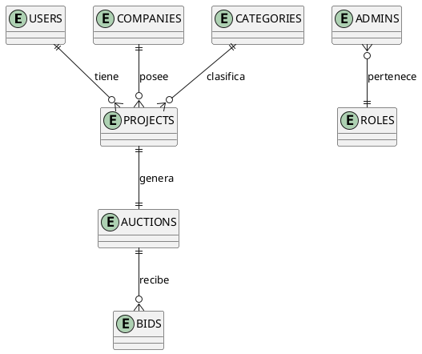

# Manual Técnico - Backend Subastas

## Índice
1. [Introducción](#introducción)
2. [Arquitectura del Sistema](#arquitectura-del-sistema)
3. [Requisitos del Sistema](#requisitos-del-sistema)
4. [Estructura del Proyecto](#estructura-del-proyecto)
5. [Configuración del Entorno](#configuración-del-entorno)
6. [Base de Datos](#base-de-datos)
7. [APIs y Endpoints](#apis-y-endpoints)
8. [Seguridad](#seguridad)
9. [Modelos](#modelos)
10. [Servicios](#servicios)
11. [Middlewares](#middlewares)
12. [Manejo de Errores](#manejo-de-errores)
13. [Documentación API](#documentación-api)
14. [Diagramas Adicionales](#diagramas-adicionales)

## Introducción

Este manual técnico documenta la implementación y funcionamiento del backend del sistema de subastas. El sistema está construido usando Node.js y Express.js, siguiendo las mejores prácticas de desarrollo y patrones de diseño modernos.

### Objetivo del Sistema
El sistema proporciona una plataforma para gestionar subastas de proyectos, permitiendo a las empresas publicar proyectos y a los desarrolladores hacer ofertas.

## Arquitectura del Sistema

### Tecnologías Principales
- **Runtime**: Node.js
- **Framework**: Express.js
- **Base de Datos**: PostgreSQL
- **ORM**: Sequelize
- **Autenticación**: JWT y Passport
- **Documentación API**: Swagger
- **Manejo de Archivos**: AWS S3
- **Validación**: Joi

### Patrones de Diseño
- MVC (Modelo-Vista-Controlador)
- Repository Pattern
- Middleware Pattern
- Service Layer Pattern

## Requisitos del Sistema

### Requisitos de Software
- Node.js v14 o superior
- PostgreSQL 12 o superior
- npm v6 o superior

### Requisitos de Hardware Recomendados
- CPU: 2 cores o superior
- RAM: 4GB mínimo
- Almacenamiento: 20GB mínimo

## Estructura del Proyecto

\`\`\`
backend-auction/
├── src/
│   ├── config/         # Configuraciones
│   ├── controllers/    # Controladores
│   ├── helpers/       # Funciones auxiliares
│   ├── middlewares/   # Middlewares
│   ├── models/        # Modelos de datos
│   ├── routes/        # Definición de rutas
│   ├── services/      # Servicios
│   ├── utils/         # Utilidades
│   ├── validations/   # Esquemas de validación
│   └── app.js         # Punto de entrada
├── docs/             # Documentación
├── tests/           # Pruebas
└── package.json
\`\`\`

## Configuración del Entorno

### Variables de Entorno
El sistema utiliza las siguientes variables de entorno:

\`\`\`env
PORT=4000
NODE_ENV=development
DB_HOST=localhost
DB_PORT=5432
DB_NAME=auction_db
DB_USER=postgres
DB_PASSWORD=****
JWT_SECRET=****
AWS_ACCESS_KEY_ID=****
AWS_SECRET_ACCESS_KEY=****

AWS_REGION=us-east-1
AWS_BUCKET_NAME=auction-bucket
```

### Instalación y Configuración


1. Clonar el repositorio:
```bash
git clone <repositorio>
cd backend-auction
```


2. Instalar dependencias:
```bash
npm install
```


3. Configurar variables de entorno:
```bash
cp .env.example .env
# Editar .env con los valores correctos
```


4. Ejecutar migraciones:
```bash
npm run migrate
```


5. Iniciar el servidor:
```bash
npm run dev  # Desarrollo
npm start    # Producción
```

## Base de Datos

### Diagrama Entidad-Relación

El siguiente diagrama ER describe las relaciones principales del sistema. Puedes generarlo visualmente con herramientas como dbdiagram.io, DrawSQL o MySQL Workbench.

- **Users** (1) --- (N) **Projects**
- **Companies** (1) --- (N) **Projects**
- **Projects** (1) --- (1) **Auctions**
- **Auctions** (1) --- (N) **Bids**
- **Categories** (1) --- (N) **Projects**
- **Admins** (N) --- (1) **Roles**

> **Sugerencia:** Usa dbdiagram.io para crear y exportar el diagrama visualmente.
>
> **Extra:** Puedes incluir y renderizar diagramas directamente en este manual usando PlantUML. Instala la extensión [PlantUML](https://marketplace.visualstudio.com/items?itemName=jebbs.plantuml) en VS Code y agrega el siguiente bloque:



---

### Principales Tablas

#### Users
- id (PK)
- email
- password
- role_id (FK)
- status
- created_at
- updated_at

#### Auctions
- id (PK)
- project_id (FK)
- bidding_started_at
- bidding_deadline
- status
- created_at
- updated_at

#### Projects
- id (PK)
- company_id (FK)
- name
- description
- budget
- status
- created_at
- updated_at

[Continuar con otras tablas principales]

## APIs y Endpoints

### Autenticación
- POST /auth/login
- POST /auth/register
- GET /auth/verify
- POST /auth/refresh-token

### Subastas
- POST /auctions/create
- GET /auctions/show/all
- GET /auctions/show/id/:id
- PUT /auctions/update/:id
- PUT /auctions/update-deadline/:id
- DELETE /auctions/delete/:id

### Proyectos
- POST /projects/create
- GET /projects/show/all
- GET /projects/show/id/:id
- PUT /projects/update/:id
- DELETE /projects/delete/:id

[Continuar con otros endpoints principales]

### Ejemplo de Endpoint: Crear Subasta

**POST /auctions/create**

**Request:**
```json
{
  "project_id": 1,
  "bidding_started_at": "2025-06-20T10:00:00Z",
  "bidding_deadline": "2025-06-30T23:59:59Z"
}
```

**Response (201):**
```json
{
  "success": true,
  "message": "Subasta creada exitosamente",
  "data": {
    "id": 5,
    "project_id": 1,
    "bidding_started_at": "2025-06-20T10:00:00.000Z",
    "bidding_deadline": "2025-06-30T23:59:59.000Z",
    "status": 0,
    "createdAt": "2025-06-18T12:00:00.000Z",
    "updatedAt": "2025-06-18T12:00:00.000Z"
  }
}
```

**Response (Error):**
```json
{
  "success": false,
  "message": "Ya existe una subasta para este proyecto",
  "error": "auction_exists"
}
```

> **Revisa la documentación Swagger en /api-docs para más ejemplos de endpoints.

---

### Ejemplo de Endpoint: Obtener Subasta por ID

**GET /auctions/show/id/:id**

**Request:**
```
GET /auctions/show/id/5
Authorization: Bearer <token>
```

**Response (200):**
```json
{
  "success": true,
  "data": {
    "id": 5,
    "project_id": 1,
    "bidding_started_at": "2025-06-20T10:00:00.000Z",
    "bidding_deadline": "2025-06-30T23:59:59.000Z",
    "status": 1,
    "createdAt": "2025-06-18T12:00:00.000Z",
    "updatedAt": "2025-06-18T12:00:00.000Z",
    "project": {
      "project_name": "Sistema de Reservas",
      "description": "App para reservas de hoteles",
      "budget": 5000
    }
  }
}
```

**Response (404):**
```json
{
  "success": false,
  "message": "Subasta no encontrada",
  "error": "auction_not_found"
}
```

---

### Ejemplo de Endpoint: Actualizar Fecha Final de Subasta

**PUT /auctions/update-deadline/:id**

**Request:**
```
PUT /auctions/update-deadline/5
Content-Type: application/json
Authorization: Bearer <token>

{
  "bidding_deadline": "2025-07-05T23:59:59Z"
}
```

**Response (200):**
```json
{
  "success": true,
  "message": "Fecha final de la subasta actualizada exitosamente",
  "data": {
    "id": 5,
    "bidding_deadline": "2025-07-05T23:59:59.000Z",
    "updatedAt": "2025-06-18T13:00:00.000Z"
  }
}
```

**Response (400):**
```json
{
  "success": false,
  "message": "La fecha final debe ser posterior a la fecha actual"
}
```

---

### Ejemplo de Endpoint: Login

**POST /auth/login**

**Request:**
```json
{
  "email": "admin@empresa.com",
  "password": "12345678"
}
```

**Response (200):**
```json
{
  "success": true,
  "token": "<jwt_token>",
  "user": {
    "id": 1,
    "email": "admin@empresa.com",
    "role": "Administrador"
  }
}
```

**Response (401):**
```json
{
  "success": false,
  "message": "Credenciales inválidas"
}
```

---

### Ejemplo de Endpoint: Crear Proyecto

**POST /projects/create**

**Request:**
```json
{
  "company_id": 2,
  "name": "Sistema de Reservas",
  "description": "App para reservas de hoteles",
  "budget": 5000,
  "category_id": 1
}
```

**Response (201):**
```json
{
  "success": true,
  "message": "Proyecto creado exitosamente",
  "data": {
    "id": 10,
    "company_id": 2,
    "name": "Sistema de Reservas",
    "description": "App para reservas de hoteles",
    "budget": 5000,
    "category_id": 1,
    "status": 0,
    "createdAt": "2025-06-18T12:30:00.000Z",
    "updatedAt": "2025-06-18T12:30:00.000Z"
  }
}
```

**Response (400):**
```json
{
  "success": false,
  "message": "Datos inválidos"
}
```

---

## Seguridad

### Autenticación y Autorización
- **JWT:** El backend utiliza JSON Web Tokens para autenticar usuarios. El token se debe enviar en el header `Authorization: Bearer <token>`.
- **Roles:** El sistema soporta roles como `Administrador`, `SuperAdministrador`, `Empresa`, `Desarrollador`.
- **Middlewares:**
  - `auth.js`: Verifica la validez del token JWT.
  - `checkRole.js`: Permite o deniega acceso según el rol del usuario.
  - `rateLimiter.js`: Limita la cantidad de peticiones por IP para evitar ataques de fuerza bruta.

**Ejemplo de payload JWT:**
```json
{
  "id": 1,
  "email": "admin@empresa.com",
  "role": "Administrador",
  "iat": 1718700000,
  "exp": 1718703600
}
```

**Buenas prácticas:**
- Cambia el secreto JWT periódicamente.
- Usa HTTPS en producción.
- Limita la duración del token.

### Middlewares de Seguridad
1. **validateJWT**: Verifica la validez del token
2. **checkRole**: Valida los permisos del usuario
3. **rateLimiter**: Limita las solicitudes por IP

### Validación de Datos
Se utiliza Joi para validar todas las entradas de datos, con esquemas definidos en /validations.

## Modelos


### AdminsModel
```javascript
{
  id: Number,
  full_name: String,
  email: String,
  password: String,
  role_id: Number,
  status: String
}
```

### AuctionsModel
```javascript
{
  id: Number,
  project_id: Number,
  bidding_started_at: Date,
  bidding_deadline: Date,
  status: Number
}
```

[Continuar con otros modelos principales]

## Servicios

### EmailService
Maneja el envío de correos electrónicos usando NodeMailer:
- Confirmación de registro
- Recuperación de contraseña
- Notificaciones de subastas

### UploadService
Gestiona la carga de archivos a AWS S3:
- Imágenes de perfil
- Documentos de proyectos

### NotificationService
Maneja las notificaciones del sistema:
- Cambios de estado en subastas
- Nuevas ofertas
- Mensajes del sistema

## Middlewares

### auth.js
Middleware de autenticación que verifica tokens JWT.

### validate.js
Middleware de validación que utiliza esquemas Joi.

### upload.js
Middleware para manejo de archivos usando multer.

## Manejo de Errores

### Estructura de Respuesta de Error
```json
{
  "error": true,
  "message": "Descripción del error",
  "code": "AUCTION_001",
  "details": {}
}
```

### Ejemplo de errores comunes
- **Validación:**
```json
{
  "error": true,
  "message": "Datos inválidos",
  "code": "VALIDATION_ERROR",
  "details": {
    "field": "email",
    "message": "Formato de correo inválido"
  }
}
```
- **Autenticación:**
```json
{
  "error": true,
  "message": "Token expirado",
  "code": "AUTH_002"
}
```

**Mejores prácticas:**
- No exponer detalles internos en producción.
- Loguear todos los errores críticos.
- Usar códigos de error consistentes.

## Documentación API

La documentación completa de la API está disponible en:
- Desarrollo: http://localhost:4000/api-docs
- Producción: https://api.auction.com/api-docs

### Swagger
La documentación se genera automáticamente usando anotaciones Swagger en el código.

## Despliegue

### Requisitos de Producción
- Node.js 14+
- PM2 para gestión de procesos
- Nginx como proxy inverso
- Certificado SSL

### Pasos Detallados para Producción
1. Clonar el repositorio en el servidor.
2. Instalar dependencias con `npm install`.
3. Configurar variables de entorno en `.env`.
4. Ejecutar migraciones de base de datos con `npm run migrate`.
5. Iniciar el servidor con PM2:
   ```bash
   pm2 start src/app.js --name backend-auction
   pm2 save
   pm2 startup
   ```
6. Configurar Nginx como proxy inverso:
   - Redirigir el tráfico HTTPS al puerto 4000.
   - Habilitar SSL con Let's Encrypt.
7. Monitorear logs y métricas con PM2 y herramientas como Datadog o NewRelic.

### Buenas Prácticas de Despliegue
- Realizar backups automáticos de la base de datos.
- Usar versionamiento en S3 para archivos.
- Mantener actualizado Node.js y dependencias.
- Configurar alertas ante caídas o errores críticos.

## Mantenimiento

### Backups
- Base de datos: Respaldo diario automatizado
- Archivos: Respaldo en S3 con versionamiento

### Actualizaciones
- Dependencias: Actualización mensual
- Sistema: Parches de seguridad semanales

## Anexos

### Scripts Útiles

```bash
npm run dev          # Inicio en desarrollo
npm run build        # Construir para producción
npm run test         # Ejecutar pruebas
npm run migrate      # Ejecutar migraciones
npm run seed         # Poblar base de datos
```

### Referencias
- [Documentación Node.js](https://nodejs.org/docs)
- [Documentación Express](https://expressjs.com/)
- [Documentación Sequelize](https://sequelize.org/)
- [Documentación JWT](https://jwt.io/)

---

## Control de Versiones

| Versión | Fecha | Autor | Cambios |
|---------|-------|--------|---------|
| 1.0.0 | 18/06/2025 | Backend Team | Versión inicial |


## Diagramas Adicionales

> Todos los diagramas a continuación están en formato PlantUML y se encuentran en la carpeta `docs/diagrams`. Puedes renderizarlos en VS Code con la extensión [PlantUML](https://marketplace.visualstudio.com/items?itemName=jebbs.plantuml) o en https://plantuml.com/es/.

### Índice de Diagramas

- [Diagrama Entidad-Relación (ER)](./diagrams/er-diagram.puml)
- [Arquitectura General](./diagrams/arquitectura.puml)
- [Flujo de Autenticación](./diagrams/flujo-autenticacion.puml)
- [Secuencia: Crear Subasta](./diagrams/secuencia-crear-subasta.puml)
- [Componentes/Módulos](./diagrams/componentes.puml)
- [Flujo de Manejo de Errores](./diagrams/flujo-errores.puml)

Puedes abrir cada archivo `.puml` directamente en VS Code o copiar su contenido en la web de PlantUML para visualizar el diagrama.

---